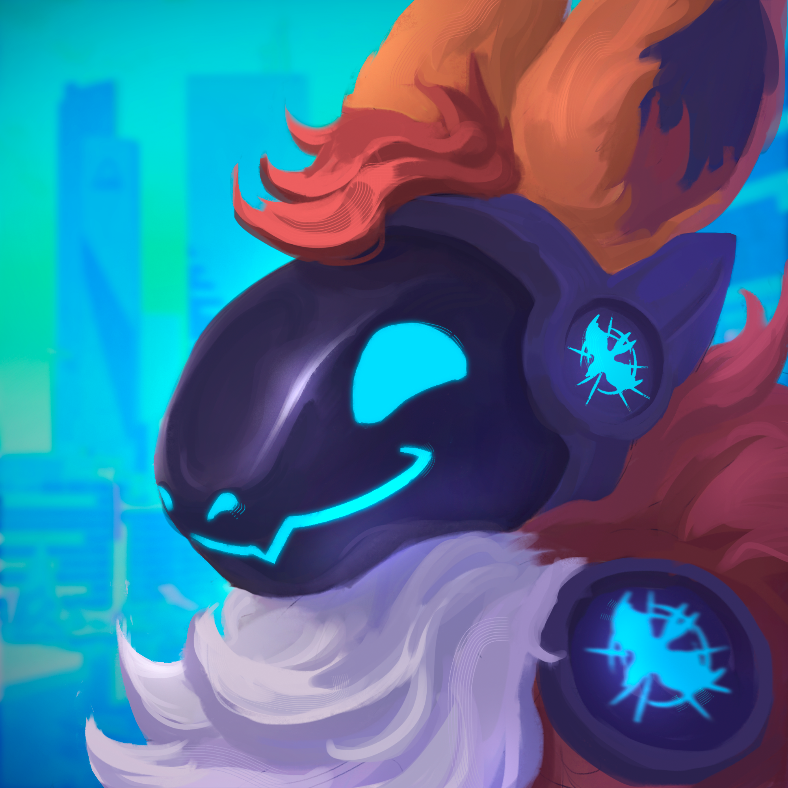

+++
title = ''
date = 2024-08-12T19:33:18+02:00
draft = false
+++

    <h1>Welcome!</h1>
    
This is the central hub for everything Proto/Prima! We want you to feel right at home. This Site serves various resources regarding the Protogen and Primagen species, from Artists, Merch, Communities over to Guides and Lore and even possibly more...

    

<h2>About us</h2>

This Project was called to life as I got a bit annoyed about how despite popular, the species seemed very niche and I had trouble to find artists to draw my beautiful boy. Adding to that I wanted to build my own Protogen, lacking any ressources to the exact process with tutorials or materials required. So I've decided to gather it all in one place.
 

      

          <a href="https://kai.shibabox.eu" class="btn btn-secondary">
              <i class="fa fa-star"></i> Get Started!
          </a>
          <a href="https://mike.shibabox.eu" class="btn btn-secondary">
              <i class="fa fa-book"></i> About
          </a>
      

          <a href="https://ko-fi.com/shibabox" class="btn btn-primary">
          <i class="fas fa-mug-hot"></i> Support us!
          </a>
  

 
 

<link rel="stylesheet" href="https://cdnjs.cloudflare.com/ajax/libs/font-awesome/6.7.0/css/all.min.css">