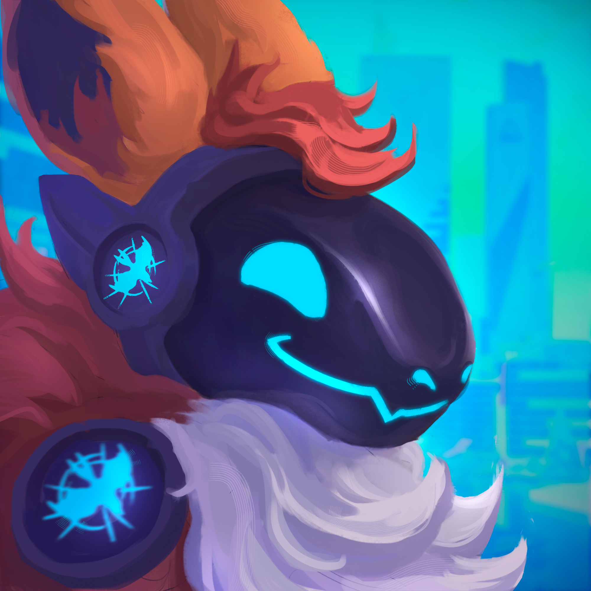

+++
title = ''
date = 2024-08-12T19:33:18+02:00
draft = false
+++

<link rel="stylesheet" href="https://cdnjs.cloudflare.com/ajax/libs/font-awesome/6.7.0/css/all.min.css">

            

                
            

            

                Testy1
                

                        <a href="https://t.me/Zenonclaw" class="social-link" aria-label="Telegram">
                            <i class="fab fa-telegram-plane"></i>
                        </a>
                        <a href="https://zenonclaw.tumblr.com" class="social-link" aria-label="Tumblr">
                            <i class="fab fa-tumblr"></i>
                        </a>
                        <a href="https://x.com/zenonclaw" class="social-link" aria-label="Twitter">
                            <i class="fa-brands fa-x-twitter"></i>
                        </a>
                

            

            

                SFW
                Realistic
            

        

            

                
            

            

                Testy2
                

                        <a href="https://t.me/Zenonclaw" class="social-link" aria-label="Telegram">
                            <i class="fab fa-telegram-plane"></i>
                        </a>
                        <a href="https://zenonclaw.tumblr.com" class="social-link" aria-label="Tumblr">
                            <i class="fab fa-tumblr"></i>
                        </a>
                        <a href="https://x.com/zenonclaw" class="social-link" aria-label="Twitter">
                            <i class="fa-brands fa-x-twitter"></i>
                        </a>
                

            

            

                NSFW
                Toony
            

        

            

                
            

            

                Testy3
                

                        <a href="https://t.me/Zenonclaw" class="social-link" aria-label="Telegram">
                            <i class="fab fa-telegram-plane"></i>
                        </a>
                        <a href="https://zenonclaw.tumblr.com" class="social-link" aria-label="Tumblr">
                            <i class="fab fa-tumblr"></i>
                        </a>
                        <a href="https://x.com/zenonclaw" class="social-link" aria-label="Twitter">
                            <i class="fa-brands fa-x-twitter"></i>
                        </a>
                

            

            

                SFW
                Toony
            

        

            

                
            

            

                Testy4
                

                        <a href="https://t.me/Zenonclaw" class="social-link" aria-label="Telegram">
                            <i class="fab fa-telegram-plane"></i>
                        </a>
                        <a href="https://zenonclaw.tumblr.com" class="social-link" aria-label="Tumblr">
                            <i class="fab fa-tumblr"></i>
                        </a>
                        <a href="https://x.com/zenonclaw" class="social-link" aria-label="Twitter">
                            <i class="fa-brands fa-x-twitter"></i>
                        </a>
                

            

            

                NSFW
                Realistic
            

        

        <-- Cards go above here-->
    

