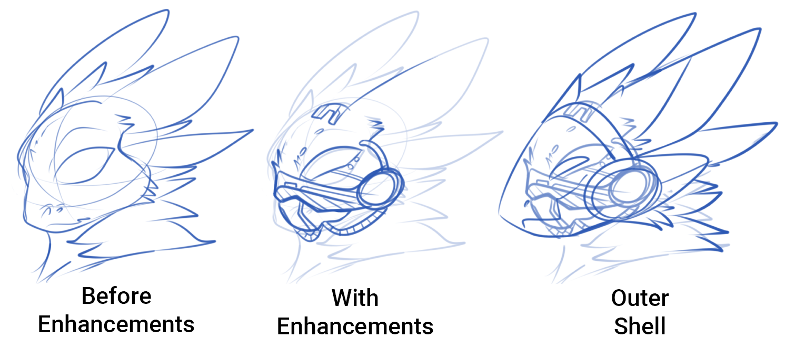

+++
title = 'FAQ'
date = 2024-08-12T19:33:18+02:00
draft = false
+++

## Protogen FAQ
This FAQ section covers all Protogen related topics, if you have a question that is not covered in the list please go to our Discord Server (see top "Official Discord"), in which we have a Q&A chat.

### What is an open species?
Open species are unique fictional species that have been created by independent artists. The term 'open' refers to the ability of public use and access meaning the species can be freely created and used. While publicly available these species still usually follow a set of anatomical rules and lore that help it be identifiable much like animals in real life. Protogen are an open species to allow free creation of creatures from ZOR, allowing people to make their own stones and characters based in/off the universe.

### Can I make my own Protogen?
Yes you are able to make your very own Protogen! Common & uncommon Protogen have no restrictions on the amount you can own. Please just make sure to follow the creation guide!

Individual owners can own up to a maximum of 8 individual RARE designs to discourage character hoarding.

### Can I feature Protogen in my creations?
Public use/features of Protogen in artwork, media, books, games etc is fine with no royalties or specific permission required. A royalty would only be arranged if the works by Cool Koinu are being resold / used for profit. You retain all rights to your artwork/product and by featuring Protogen you have agreed to the community creation guidelines.

Primagens (Closed sister species to Protogen) do require special permission to use outside of fan-art, as the species has restricted use.

### Why are RARE Traits restricted?
RARE traits are restricted as these are features that were not meant to be heavily associated with the species. From a lore standpoint, Protogen were designed to be subservient bi-pedal mammals. The ability to fly would have been a disadvantage for Primogenitors. The other aspect is that these features are also used by many other open/closed species groups, and by limiting the species to a specific set of physical traits the species maintains their aesthetic.

We understand that these features are in demand and sought for, which is why we try to offer Make Your Own (MYO) slots in multiple ways such as direct sale and event prizes!

### How can I get my own Rare Protogen?
There are a few ways for obtaining a Rare Protogen for official use in our community:
- You can win an event that lists a Rare Make Your Own (MYO) as a prize.
- We host a bi-yearly raffle which you can enter by joining in our events. More info can be found here: The Bi Yearly Raffle Info.
- Buying a MYO slot when it is available for purchase (Flat price 300$, must be 18+ as per Cool Koinu's T.O.S).
- Buying an official Rare that is being sold by another member.
- Winning an auction for a premade Rare (These can only be held in the official Action chat in the official ZOR Discord server,  must be 18+ as per Cool Koinu's T.O.S).

Please note that all raffles and events are only held in the official ZOR Discord server by staff! If you are ever unsure about a Rare Protogen for sale, you can ask a moderator for the official ownership details.

### Can I make a 'non-canon' Protogen?
You are free to make a Protogen which does not follow any of the original lore's backstory or universe physics. This Protogen should still fit within the species design and rarity system, but does not have to physically function in reality/ZOR Universe. 

<u>We simply do not moderate the species outside of our official social hubs, and we ask NO ONE to moderate on our behalf.</u> Koinu and the Staff Team completely condemn any sort of ‘white-knighting’ or other methods of harassment towards non-canon or unofficial designs, and such actions may get you banned from the community.

Examples of  non-canon:
- A Protogen that can remove the chest piece / crotch plating.
- A Protogen that is made out of an inanimate substance, (Jelly, plush, food, elemental, etc.)
- A zombie, undead, or ghost Protogen
- A Protogen shapeshifter/Protogen form. 
- Feral form / Snake body or non-conventional body build shapes.

<u>Rules that still need to be taken into consideration:</u>
The rarity traits (An unofficial RARE Protogen is not accepted, as this still portraying restricted features) and the restricted traits (Primagen Traits, Mixed fandom species ect…)

**We have a dedicated chat for non-canon Protogen within our Discord server. If you wish to make a non-canon Protogen, you can post it there. In the other chats on that server we request that you make sure your design fits within our species standards before posting, thank you.**

### What if I disagree with the design rules?
The design rules have been structured to make sure that Protogen are identifiable within the open/closed species community like other cyborg characters and species. If you disagree with the design limitations or species rules, please consider utilizing the spaces provided for non-canon and unofficial characters.

### Is NSFW/18+ artwork and media acceptable?
NSFW/Not Safe for Work or 18+ artwork and media featuring Protogen is fine. We do not post any NSFW pieces within our community hubs as they are used by people of all ages, please make sure to only post this content where permitted. (FurAffinity/Twitter/Art sites/places that accommodate adult content.)

### What do Protogen run on?
Protogen have an active digestive tract which allows them to consume food/Nutrients for energy. The food enters the stomach then processes through an advanced artificial organ which stores some of the power created from broken energy molecules. This energy is then converted into electricity which powers the artificial parts, and the remaining energy consumed by food is used to support the remaining biological organs and cell production.

While uncommon, Protogen can also use Arcai energy to operate. A Protogen can go many years without food and run solely on electricity, Arcai or other alternative energy sources but it is not recommended as the biological parts will lack the needed nutrients. The Protogen will need to consume proper nutrients to maintain full biological function.

### Do Protogen poop?
Protogen's were designed to be efficient, natural waste removal is a timely process so a vaporization method was implemented to increase productivity. The waste is vaporized internally through a special artificial organ and a residual gas is very sparingly released (to not come out as a noticeable smell). So they do not poop but I guess it could be considered a fart? (This includes all waste types.)

### What can a Protogen visor show?
A Protogen’s visor can show any image you’d like! The Visor’s outer nanite shell has the ability to light up in any color just like a computer or TV screen, thus they can display anything they would like. Anything the visor shows doesn’t relate to any rarity.

### What's under a Protogen's visor?
Underneath the visor of a Protogen you'll find the original face structure submerged in a cybernetic fluid. all holes in the face have been blocked and mechanically modified to not interfere with the visor’s nanites. The mechanical enhancements shown in the example can vary in design however generally the augmentations are made to fit with the brain alongside the entire front of the face, nose and eyes. Their lower jaw has been completely removed to make way for the visor to be used as the external lower jaw. 

### Do Protogen need Sleep?
Protogen do not require sleep but intermittent breaks and restarts allow time for firmware updates. A Protogen can go into a hibernation mode if needed (In case of emergency or inactive use).

### Can Protogen feel emotions?
Protogen can feel any normal emotions just like you. The Arcaits in their brain only keep them subservient to their owner, it doesn’t reduce any other normal brain functions. But over all, your Protogen’s personality and emotional state is completely up to you as the owner!

### How does Arcai work?
We have specific guides to describe how Arcai works!

 

      

          <a href="/pages/res/protogen/arcaifundementals/" class="btn btn-secondary">
              <i class="fa fa-star"></i> Fundementals
          </a>
          <a href="/pages/res/protogen/arcaireligion/" class="btn btn-secondary">
              <i class="fa fa-book"></i> Religion
          </a>
      

  

### Do Protogen smell and taste?
Yes, Protogen are able to detect smells through specialized nanites that have smell receptors. These carry the scent information to the brain much like in humans or animals. Protogen are able to taste but that ability is limited as their taste receptors are fewer in number. Their ability to taste is about half as good as that of a human.

### What are Protogen Firmware Updates for?
These digital updates are accessible through the Proto neural net and allow Protogen to download updates for their artificial components. These updates are usually made by the Syantika faction to better help the Protogen species and offer exchangeable trade for their services.

### How do Protogen Breathe?
Protogen do require oxygen to survive but can adjust to the levels in the provided environment. Protogen breathe through the visor as nanites carry in oxygen molecules to special receptors located in the back of the throat. The Protogen then inhales this storage of oxygen molecules, the action is similar to a normal breath. If the Protogen is submerged in water, the nanites will close up stopping this molecule delivery system.

Aquatic Protogen possess a gill system which allows them to adapt to this environment.

### Can a Protogen live in space?
A Protogen cannot survive permanently in the vacuum of space and will need oxygen to provide required nutrients to cell production and function. A Protogen can go out into space without additional protection or gear but it is not recommended as they are not 100% protected from radiation.

### Do Protogen contain Magnetic properties?
Yes, Protogen do contain magnetic properties. The exact makeup is unknown as the Primogenitors have always been very secretive of their research but from available information they do possess some level of ferromagnetism.

### How do Protogen communicate?
Protogen are able to communicate in a multitude of ways. Protogen can either learn certain language dialects (Alien or earth origin) or use a variety of clicks, beeps, buzzes and robot jargon. Protogen can also communicate via a telepathic network wired to their species.

Their base dialect and language study does derive from the Primogenitors own language but this only by default.

### What Kind of equipment can Protogen have?
Protogen can have any kind of gear/equipment or items, there are no limits on what you can add to the armor gear (besides equipment trying to specifically imitate rare traits, as those would simply count as those traits).
Some acceptable examples are: 
- Speakers/music devices
- Guns/weapons/lasers
- Small robotic 'helper' arms
- Medical equipment/surgical gear
- Clothes and accessories (Of any sort)

### What kind of Vehicles do Protogen use?
Protogen can operate a variety of vehicles including space craft and EVAS. Most of these were built by Primogenitors but some Protogen have crafted their own vehicles.

### Can an EMP (Electromagnetic Pulse) kill a Protogen? 
Yes an EMP can be fatal if it's strong enough. The average protogen has safeguards in place for low level EMP's. stronger EMP's and even lightning strikes will overpower these safeguards. Protogen can also be created with stronger safeguards against EMP and other electrical surges, and a Protogen proficient in Arcai practices that involve the control of electromagnetic waves may be able to be immune all together.

### Can Protogen reproduce?
Protogen are not able to reproduce, the artificial growth and mechanical synchronization renders the species sterile. Arcaite transfer would not be possible via natural birth process and thus the species have been genetically altered to produce no eggs, sperm or growth of internal reproductive organs. External reproductive organs are entirely optional but do not have any reproductive ability.

The concept and design of external reproductive organs is entirely up to the Artist/Owner.
