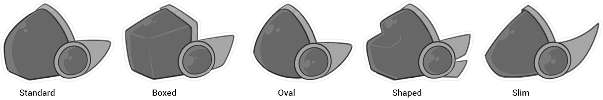
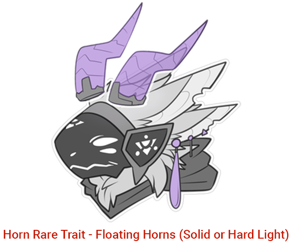
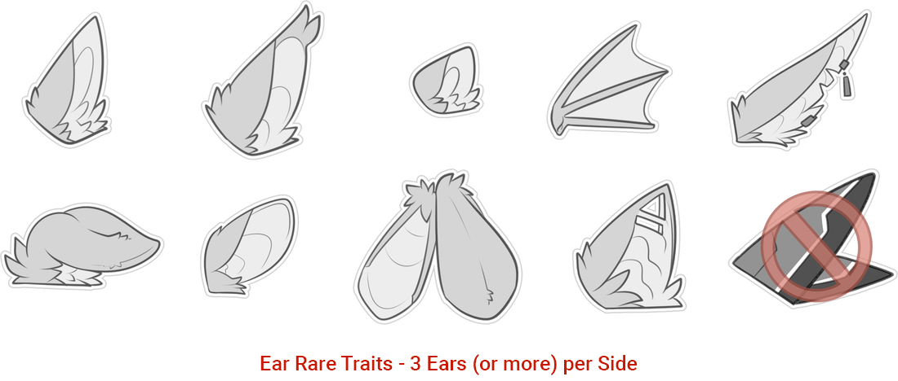
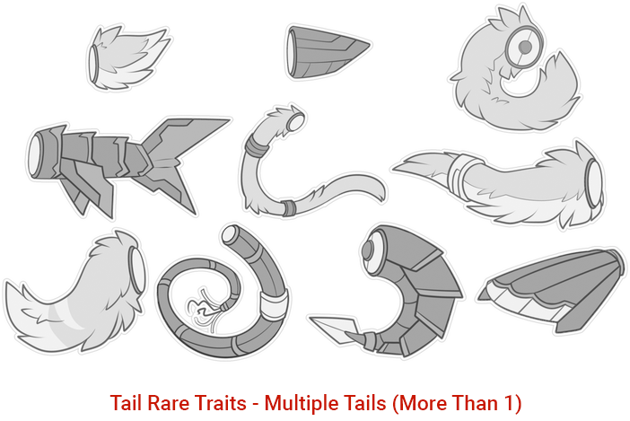
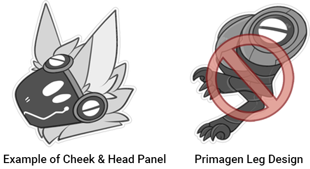
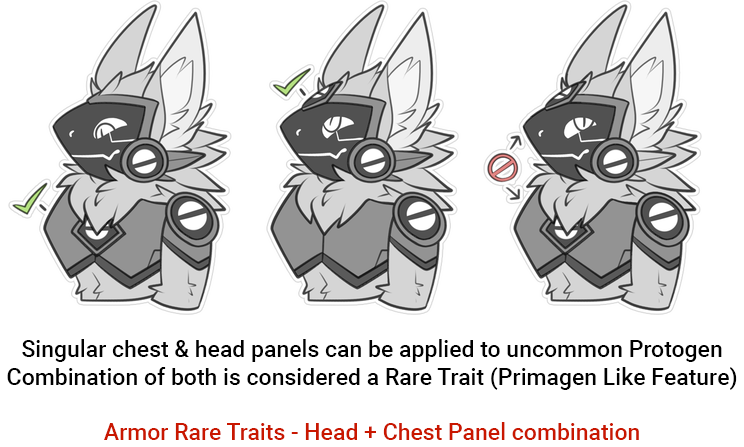
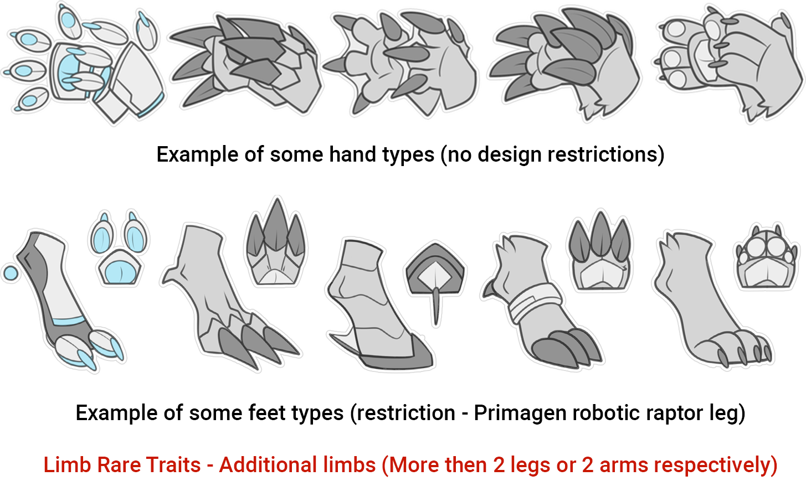
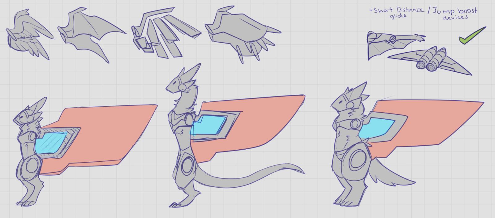

+++
title = 'Getting Started'
date = 2024-08-12T19:33:18+02:00
draft = false
+++

## Creating Your Own Protogen
Before creating your own Protogen, please make sure to read the guides available to ensure your design fits within the species general appearance. Fictional Species in the Art & Furry Fandom are founded by their unique design, characteristics, and lore. Which is why a comprehensive guide has been made for those interested in the beings & creatures within ZOR. There is also an FAQ located further down on this page.

### Personal / Commercial use
If you have an existing character, you are free to make a Protogen form, or an entirely new character from scratch! Both pay-to-use & free line-art bases are available within the community for those less confident with art. Alternatively, you can commission an artist of your choosing for a reference sheet. You are also able to sell / trade Protogen to other community members. 

### What are the minimum requirements?
The minimum requirements for a Protogen are: the visor display face, Armor: Torso plate, groin, hip plate and mechanical thighs (Thick or slim) (Rib cage must be covered/protected.), biological ears,Limbs: At least 3 limbs (4 limb sockets + 1 tail socket)(One can be completely missing) - Replacements ok! Artificial/biological. To be classed as a Protogen, the design must contain these core features to be identified as a part of the species. Please make sure to check all the information available on this page!

### A couple of things to remember
- Does the design meet the species standard?
- Does my design have canon or non-canon traits? (See our non-canon guide for more info)
- Purpose (What purpose does your Protogen serve? It can be purely recreational!)
- Rarity Traits (What kind of traits do you have? Only rare traits are restricted from free use.)
​- Remember to have fun, don't be afraid to ask questions, and think outside the box!

## Up to the Artist / Protogen Owner
Your design is purely up to you, so long as it still fits within the species general appearance and guidelines. So please feel free to play around with armor shapes, biological limits, and accessories to the fullest! For some ideas, what are your favorite environments? Consider basing your Protogen’s traits on what would be needed to survive in that terrain!

You are also free to add additional equipment, clothes, accessories, etc..

Outside of the design, you are also free to give your Protogen its own personality & story. Your Protogen is able to exist in its own crafted universe or existing one and does not have to follow ZOR lore. 

Some more things besides design that are totally up to the artist / owner include:
- Backstory / Character story / Personality & characteristics
- Age / Gender / Name / Feature or function details

## Aesthetic Variants / Examples
### Visor Shapes
Protogen have a short visor usually with rounded edges, this is the standard visor shape! 
Visors can however be as uniquely shaped as needed. Here are some standard examples of visors:
**Visors can deviate from the main shapes below (more/less curve on edges etc.)**

### Horns / Spikes
Protogen can have horns of almost any shape and size, this is considered an uncommon and above trait. Protogen can also have spikes anywhere on the body as well as some small floating hard light kind. There is no specific limit or count for spikes / horns.

The only RARE feature is floating Horns (Solid or hard light). This is a very sacred symbol of high Arcai power and is a restricted feature to coincide with ZOR lore.

### ​Ear Examples
Ears can be a variety of different shapes and sizes. There is only one limitation and that is the ears need to be biological in nature (Varying biological materials). Common Protogen are allowed up to one set of ears, Uncommon can have up to two sets. They do not need to be furred and can have a variety of accessories. Protogen can also have no ears (uncommon trait).

Here are a few examples: **Ears can vary outside the designs below, these are only a few examples. The only limits are mechanical ears (Primagen only) & 3 ear sets for Rares.**

### Tail Examples
Tails can have a large range of shape / size & function. Please be creative as possible, you can have as little or as much mechanical parts for your tail. ‘Tail mouths’ are considered a non-canon trait.

Here are <u>some</u> examples: 

**Tails can vary outside the designs below, this is only a few examples. Common & uncommon Protogen are limited to 1 tail present on the design, but are allowed to swap out to an infinite amount of designs with the 'plug & play' system.**

### Armour Shapes / Requirements
Armor shapes can be any practical shape. Extra armor such as 'flip down visors', gauntlets, Arm plates, leg/feet gear, tail armor is all optional. Protogen only require the minimum armor below:
- Chest Plate (Must cover the whole of the ribcage, any Shape)
- Groin Plate (Any Shape)
- Thigh Plates (Must cover majority of the thigh, any Shape)

Cheek and shoulder plates are optional, <u>but is recommended as its a very defining feature of the species.</u> Alternatives for screens can be any sort of plate or 'accent' on the cheek. Removal of the chest, groin or thigh plate is considered non-canon.

Some mechanical combinations are restricted to RARE such Head+ Chest Panel combination. The only feature that is totally restricted from Protogen, regardless of rarity, is the Primagen leg design (also referred to as mechanical raptor design) This is because it is a Primagen only feature.

### Hand / Feet Examples
Protogen can have a variety of hand / feet shapes & sizes. The most common hand shape is a clawed paw of 4 to 5 digits, but this is only the species standard. Protogen have 2 arms, 2 legs, and 1 tail as standard. Any more limbs is considered a Rare Trait. Protogen can have either mechanical, biological, or holographic/hard light hands and feet. Both arms, legs or tail can be of either make up. (All limbs can be fully biological, artificial, or a mix)

Protogen can also have some additional mechanical extras such as a small set of mechanical 'Helper' arms/hands that may only extend to half the length of a proportional arm, tool backpacks, or weapon extensions fitted to the back / arms / legs. These are available at the uncommon rarity.

The arms, legs and tail can be 'floating' or not completely joint to the body, this is an uncommon trait (hard light / holographic limbs qualify as 'floating limbs'). Hands/Feet can vary outside the designs below, this is only a few examples. Only limits are mechanical raptor legs (Primagen only trait).

### Small Non Function Wings & Jet-pack Propulsion 
Small non-functional (or decorative) wings are permitted for uncommon Protogen. This also includes 'gliding' aids such as a membrane-like attachment from the arm to the body. Jetpack propulsion is permitted, but is also limited to short function use & size restrictions. Small decorative/chibi wings must be no larger than the torso of a Protogen.

Fully Functional Wings (FF Wings) are a Rare trait. They can have a wide variety of designs from 'hard light' materials to biological. These wings are medium to large sized for realistic functionality.

### Sizing / Colossal Protogen / Micro Protogen
The standard species height for Protogen is 120 - 180 cm (Roughly 4 to 6 ft) with a mass range of 40 kg to 200 kg (88 oz to 440 oz). The general common range is between 90 cm at the smallest, and 200 cm at the tallest. Any Protogen above that is considered a colossal Protogen, and anything below is considered a Micro Protogen. 
Micro and Colossal Protogen are an uncommon trait, but do keep in mind that the size you pick must still be realistic to an extent! Extremely unrealistic sized Protogen (Cell / Germ Sized | Planet / Galaxy Sized, Anything Unrealistic, Extreme Macro / Micro etc) are non-canon to the Protogen species.

## Limitations
Protogen have a few limitations that restrict some features from being used within the species official communities, we divide these into two sections, non-canon and restricted. Non canon designs simply do not work within the lore set in the Zenith’s Outer Reach Universe, and to keep the species as a coherent singular species we ask that you don't break these design rules within our official hubs. We <u>DO NOT</u> moderate non canon designs outside of our official hubs under any circumstance. 
Restricted traits on the other hand are more about respect for Cool Koinu as the creator of the species as well as other original species creators within the furry community. We also don't moderate those outside of our official hubs, but we kindly ask that you refrain from breaking these more than the non-canon traits. 

### Non-Canon
- Feral or quadruped Protogen (On all fours)
- Removal of the chest or groin plate
- Biological legs (Missing thigh armor)
- Tail Mouths / Belly Mouths ( Or limbs that are a separate entity)
- Zombie / Undead (Not alive - this does not include ‘necromancer’ arcai abilities which is canon)
- Mermaid / Naga / Snake like lower half
- Extremely unrealistic sized Protogen: Cell / germ sized | Planet / galaxy sized, anything unrealistic (Extreme macro / micro etc)

### Restricted
- Primagen Traits (Artificial ears, raptor feet / mechanical leg combo, no chest or groin plating - very specific design)
- Lack of limbs entirely (Would render Protogen useless)
- Lack of head
- Mixed fandom species (Hybrids of existing fandom species - Wicker beasts, Avali, Sergal, Manokit for example)