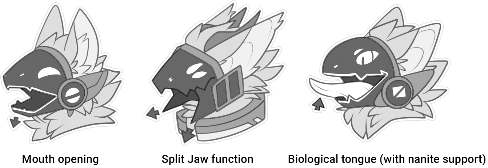
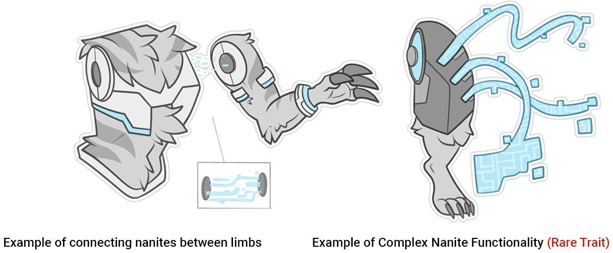
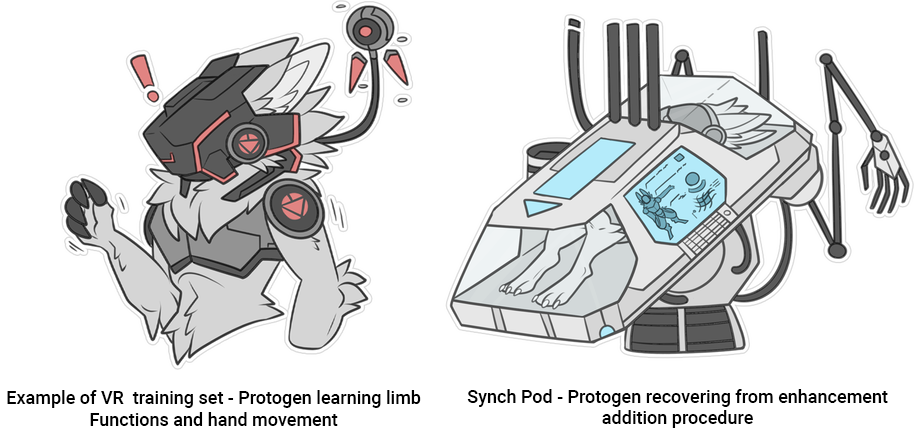

+++
title = 'Official Guide / Lore'
date = 2024-08-12T19:33:18+02:00
draft = false
+++
Exerpt from the official guide (Google Doc)
## What is a protogen?
Pronunciation: /'prəʊtəʊˌdʒen/ | 'Prow-toe-jen'

Protogen are a cyborg Alien species that are found in Zenith's Outer Reach (ZOR), a mammalian based creature created artificially for space & planetary exploration. Protogen vary depending on the 'DNA infusion' levels allowing Protogen to have an array of features & functions to help serve their purpose.

Core features of a Protogen include a visor display face, artificial chest & hip region, biological ears and a mix of artificial/Biological limbs. These are the most distinguishable features to identify a Protogen.

## DNA Origin & Species History
The Protogen species was created by a highly advanced alien race known as the Primogenitors or ‘Creators’. The Creators sought to create a cybernetic fusion lifeform which would replace areas of the AI industry that benefited from having the judgments and situational awareness of a biological being. The civilisation occupies Esmire 4, Oris, and Vehtas within their solar system.

The original DNA source of the Protogen was sampled from a primordial alien species known as Dyniretar which was discovered in Cycle 10 on planet Lyranium within the Reddus Nebula. The DNA source allowed the Creators to bioengineer the perfect ‘blank’ lifeform ready for cybernetic enhancements and consciousness implant. Records of this species' original appearance are almost non-existent due to heavy modification to the DNA source and access to samples are highly regulated by Primogenitor scientists.

Protogen were designed to uniquely fit their environment and task perfectly, making them extremely diverse in use. This granted a fair physiological range of protogen forms, some easier to maintain or control than others. Depending on their functional or physical form the Protogen will be assigned a rarity class (common, uncommon and rare) which impacts the amount of Arcaites that need to be implanted.

To keep the species as subservient and as compliant as AI, Project ARC (ARC - Artificial Remote Control) was initiated. Primogenitor scientists infused microcrystalline ‘Arcaites’ into the cerebral fluid of the Protogen during development, allowing total mind control over the specimen. This made Protogen obedient to follow tasks and minimize free thinking; many ethical issues started to develop around the use of Arcaites once research was released.

Further mutations and the addition of complex features became subjected to Arcaite instabilities. The creators wanted to create an elite class of Protogen capable of complex abilities such as flight, nanite manipulation, and multiple limb ranges, but these features often overloaded their control systems, causing Arcaites to short out. These elite Protogen or ‘RARES’ were considered to be very dangerous as they often became uncontrollable or rogue.

Over time, demand for Protogen production increased significantly within many industries. Construction, labor, military, and old models were often abandoned or disposed of. Protogen with Arcaite instabilities, RAREs, or with no needed purpose became victim to eradication, which led to the formation of rebellion groups which fought for liberation. Some of these discarded Protogen relocated to one of Esmire’s moons to form their own colonies.

The rise of the Protogen rebellion and the ethical use of Project ARC had led to a segregation within the Primogentors' Empire. Two factions rose from the turmoil known as the Syantika and the Nehixim. The Syantika wish for a peaceful coexistence with their creation while Nehixim wish to reconfigure or terminate the remaining ‘defective’ Protogen.

While turbulence between the factions continues, the Protogen species has founded their own small society on E1 (1 of 3 moons of Esmire). The moon was terraformed and has become the capital homeworld to the Protogen, where they have thrived and advanced their own knowledge and capabilities with Arcai power. Mutual agreements made between the Protogen and the Syantika has led to a mostly peaceful symbiotic relationship with trading and resources. Nehixim faction still holds majority over all Protogen production facilities and continues to improve Project ARC.

## ​General Core Features / Makeup of Protogen
- Short Round Edged Visor
- Biological Ears
- Protective Chest Plate (Exoskeleton)
- Particle Visor (Open/Closes)
- Biomechanical Modular Limbs
    - 40% Artificial (Biomechanical)
- Upright Position / Bipedal
- Mammal Behaviorism
- Active Digestive tract
- Cheek accent plate with ridge

## Age, Mass, & Height Averages
Since Protogen are able to continuously upgrade parts there is no particular age limit, the limiting factor will be the Protogen's ability to access the necessary upgrades in order to continue function. Organ transplant and artificial procedures can help a Protogen to continue to operate at fully functional capacity. Failure to replace old organic or mechanical parts may cause the Protogen to lose function, or worst case scenario, death. The standard species height for Protogen is 120 - 180 cm (Roughly 4 to 6 ft) with a mass range of 40 kg to 200 kg (88 lbm to 440 lbm). Mass will vary on biological make-up. Some models were also made in extremely unusual sizes. This included a model range known as 'Micro-gens' and 'Colossal Protogen'. These models allowed Protogen to range from 10 cm tall to 10m. These size specifics made it hard to balance the right amount of ARC Nanites and thus these models faced many Nanite instabilities. 

Colossal Protogen - 200 cm and above         |            Microgen - 90 cm and below

## The Visor
The visor on a Protogen is made out of millions of small particles known as 'nanites'. These nanites act as a shield/barrier between the outside world and the internals of the Protogen's visor. Nanites are able to move freely and reassemble their position, this allows a Protogen to open and close their mouth. When eating, a gap between the face and esophagus is made to allow nutrients to be digested. The visor itself cannot be removed as the internal barrier is holding essential blood & fluid. If cracked or damaged, the visor will have an almost immune system-like response and cluster to protect the internal barrier. Protogen may lose nanites through blunt force trauma, this may lead to cracks and gaps in the outer shell layer, but the internal layer will always be protected. If the internal layer of nanites is compromised, then it will usually lead to permanent damage and eventually death. Vision is artificially enhanced by the visor allowing the Protogen to have visual display overlays, thermal and other alternative optical abilities. The visor also allows scents to penetrate through a special set of Nanite receptors which carry the information to the brain. Nanites are not bound to any particular coloration or density, only that they have an outer and internal set to form proper functionality. As a greater precaution and an optical upgrade, some Protogen have been fitted with an additional flip down visor, which adds an extra layer of protection and functionality. This add-on is removable and completely optional.

## 'Plug & Play' Limb System
The mechanical chest and lower torso of a Protogen allows the limbs to work in an adapter-like fashion. This is the plug and play limb system. Limbs attach to the socket area with special magnetic nanites, these particles allow a solid connection as well as transmitting neural data between the limb and brain of the Protogen. Protogen are able to remove and join new, or alternative limbs, to the main body. This also allows the Protogen to easily remove a critically damaged part, or change a part to better suit the current environment.

Standard limb count is: 2 arms, 2 legs and 1 tail.

​This allows the Protogen to fit the most desired function. Primogenitor researchers found Arcaite instability issues when more limbs, or complex systems such as flight, were introduced. This put heavy restrictions on the production of complex models as they served a higher chance of becoming rogue.

## Nanite Functionality
Nanites play a large role in Protogen functionality. Many different types of nanites have been modified to serve particular roles and purposes in the bodily function of Protogen. The two main functions that nanites serve in all Protogen is visor (functional and protective layers) and limb connectivity.

- Nanites range in size from 20,000 to 100,000 nanometers (Not individually visible with the naked eye) Their name comes from the size range they sit within.
​
- Nanites can be replenished / replace if damaged

- Allow nutrient and nerve information to be transferred between the body and limb (through plug and play) / blood, nerve control, etc.
- Magnetic nanites hold limbs in place
​- Nanites also allow control on bodily hormones and chemicals allowing the physical state to cope under various conditions. (Adrenaline boost, serotonin under injury etc)

Some Protogen are also capable of complex nanite functionality, a feature only found in RARE Protogen. Some of these abilities include the ability to mass manipulate nanites into physical shields, barriers, and even as far as 'duplicate self' consisting purely of nanites. There is little Primogenitor research on these complex features as they are very uncommon occurrences.

## Growth Process
All Protogen are created within the production facilities located on ESMIRE 4. Protogen are artificially inseminated under lab conditions and grown in artificial tank systems that simulate womb-like conditions. The growth process takes a total of 21 days on average and an additional 14 days of artificial synchronization and training.

Each Protogen's DNA has been altered and configured to specific requirements. This allows the Protogen to grow to the exact form that is needed. Once optimal size and full development has been complete, artificial transplants and treatments add all cybernetic enhancements required. The Protogen is also placed in a specialized med pod called a 'Synch Pod' allowing time for the artificial and biological parts to merge. All of this is done before the Protogen is 'born', or has experienced conscious reality.

Once they are physically complete, the last stage is brain monitoring and data imprinting. Protogen are administered with a direct neural input of basic functionality, purpose, and training. This data impression allows the Protogen to be fully functional at the time of first awakening. Arcaite levels and functionality is monitored and adjusted over the remaining training days.

Protogen are then put through training programs in VR chambers to further enhance their physical and mental capabilities. Upon full completion, and if the Protogen has shown adequate Arcaite synchronization, the Protogen is transported from the production facility.

## DNA Infusion, Rarity Classes & Traits
### What is DNA Infusion?
DNA Infusion allows Protogen to grow in a variety of different aesthetics and functions. Infusion is what makes each Protogen an individual. However, the level and complexity of infusion will raise or lower the rarity of the protogen. These traits are broken into 3 different categories: Common, Uncommon, and Rare. The purpose of the rarity system is to help hold a species standard, and what features apply to Protogen. 

### Common
Common Traits are features and aesthetics that all base Protogen have access to. Common Protogen have the least amount of DNA Infusion and are seen as the species standard. Common Protogen are generally subordinate to their Creators as their disposition and nature has been made to fit the needs of Primogenitors.

### Uncommon
Uncommon traits are features and aesthetics that are more complex but are still accessible to all. DNA Infusion level sits as high as 50%, allowing half of the Protogen's genetic data to be altered with varying species. Uncommon Protogen are more likely to encounter nanite instabilities due to their genetic make up making them harder to maintain control over.

### Rare
Rare traits are features and aesthetics that have reached the limitations of genetic alterations possible to the Protogen. The DNA Infusion rate is generally 50% or higher, allowing the Protogen to access non-conventional features such as full flight, multiple limb sockets, and complex nanite functions. Rare Protogen are very few in number as Primogenitors experienced numerous rebellious attributes and nanite instabilities in Protogen once the infusion level reached over 50%.

Rare Traits are not publicly accessible, but can be obtained or purchased in a few different ways (i.e. community events, adoptables, custom slots, MYO Submission forms, etc). The purpose of this restriction is to uphold the species standard design and lore, as well as providing an engaging interactive aspect to the community by offering these unique features through obtainable methods.

## ​Roles / Professions / Purpose
Protogen are created to fit a wide variety of purposes, from companionship to professional occupations. They are custom fit to their purpose. Many common occupations for Protogen include:
- Medical Response / Assistant
- Defense / Combat
- Researcher / Scientist
- Security / Data Miner
- Construction - Arcai Technician
- Pilot / Vehicle Operator

Protogen are also found outside these fields, including no particular function, purpose, or assignment.

## ​Technical Issues / Viruses / Growth Defects
### Technical issues 
​Both cyborg variants have been known to show occasional technical issues. These include, but are not limited to: power conversion failure, radiation damage from extreme conditions, ‘Jumpy robab syndrome’ or JRS, and cosmic dust build up. Protogen visors are also prone to losing nanites from blunt force or extreme magnetism resulting in cracked visors. Limb loss is uncommon, but does not fully debilitate the Protogen as replacements are an accessible option.

JRS - This is a rare condition where the internal nanite cells fall into an on/off loop for a short period of time. This causes the whole system to shut down and restart rapidly causing the Protogen to 'jump' or jolt around momentarily. This (surprisingly) does not cause much harm to the Protogen, but can be dangerous to individuals within close proximity. The correct term for JRS is actually known as Nanite Restart Syndrome but 'Jumpy robab' became a more common nickname to match the visual associated. ​

### Viruses & Hacks
Viruses and hacking have lessened since the production of Primagen units. Their signals run on a variety of complex frequencies, which are invisible to most foreign interceptors. Virus symptoms and signs include (but are not limited to) uncontrollable or violent glitching, internal electrical blackouts, or limb incompatibility.

### Growth Defects
​Due to the heavy observation of growth conditions and the meticulous process of selecting high quality genes, growth defects are quite rare. Occasionally small gene deficiencies and defects slip through the carefully monitored system, as they do not affect the function of the Protogen directly. These can include, but are not limited to:

- Coat length inconsistencies (Patchy fur, long fur, short fur)
- Abnormal toe/finger count (Lengths / shapes / make-up)
- Ear abnormalities (Missing structure/ Missing Scapha )
- Muscle hypertrophy / Muscular hypoplasia (Irregular Muscle Mass)